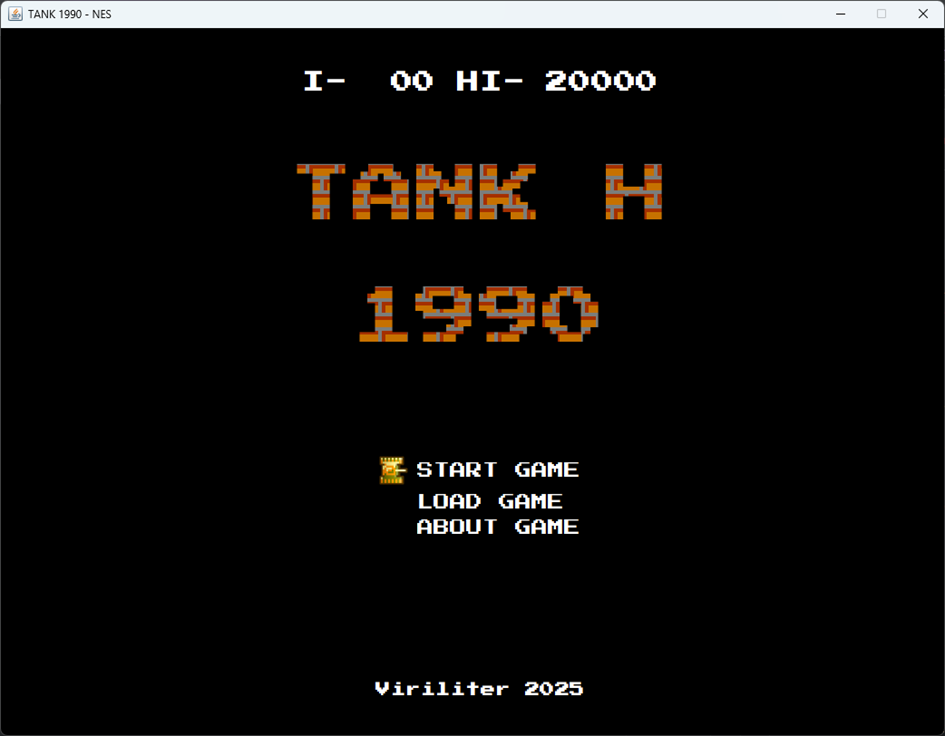
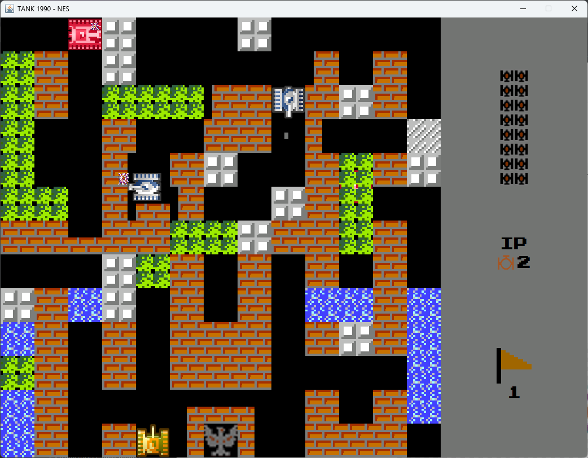

# Tank 1990 NES Remake

A simple NES-style remake of **Tank 1990**, developed in Java using the Swing library for the user interface. Gradle is used to manage the build and dependencies.

## Features

- NES-style pixel graphics
- Classic tank controls and shooting mechanics
- Simple and modular tile system
- Map generator
- Swing-based game interface
- Gradle build system

## Getting Started

### Prerequisites

You need to have the following installed:

- Java 21 or newer
- [Gradle](https://gradle.org/) (or use the included Gradle Wrapper)

### Clone the Repository

```bash
git clone https://github.com/Viriliter/Tank1990.git
cd Tank1990
```

### Build the Project

```bash
./gradlew build
```

### Run the Project

```bash
./gradlew run
```

## Project Structure
```plaintext
Tank1990/
├── src/
│   └── main/
│       └── java/
│       |   └── tank1990/        # Source code of the game
│       |       └── core/        # Core game logic
│       |       └── panels/      # Swing UI Components
│       |       └── player/      # Game Components related to Player
│       |       └── powerup/     # Game Components related to Powerups
│       |       └── projectiles/ # Game Components related to Projectiles
│       |       └── tank/        # Game Components related to Tanks
│       |       └── tile/        # Game Components related to Tiles
│       |       └── Game.java    # Game entry point
│       └── resources/           # Game resources (textures, sounds etc.)
├── build.gradle                 # Gradle build configuration
├── settings.gradle              # Gradle project settings
├── gradle/                      # Gradle wrapper files
├── gradlew                      # Gradle wrapper script (Unix)
├── gradlew.bat                  # Gradle wrapper script (Windows)
└── README.md                    # Project documentation
```

## Screenshots




## Contributing
N/A

## License
This project is licensed under the MIT License. See the LICENSE file for details.

